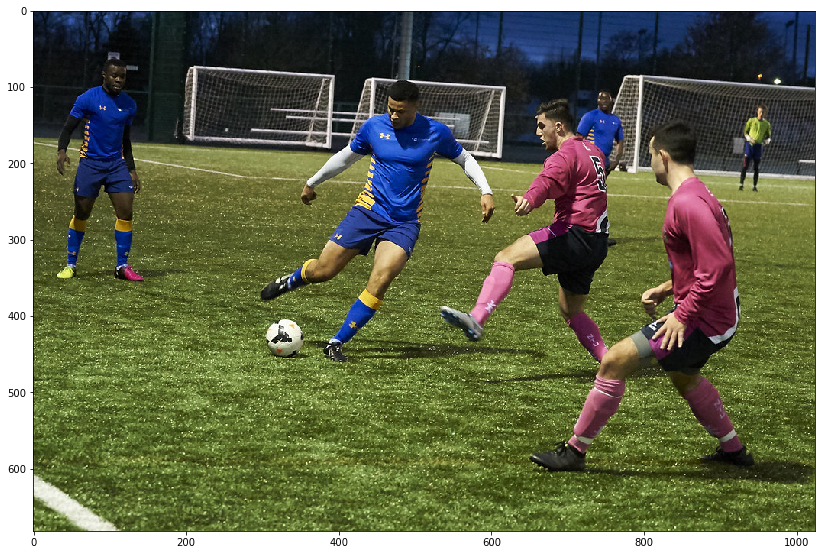
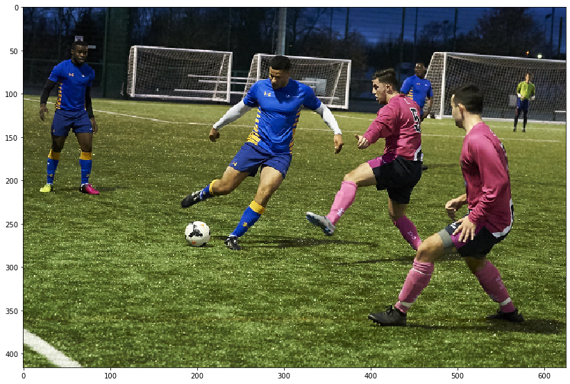
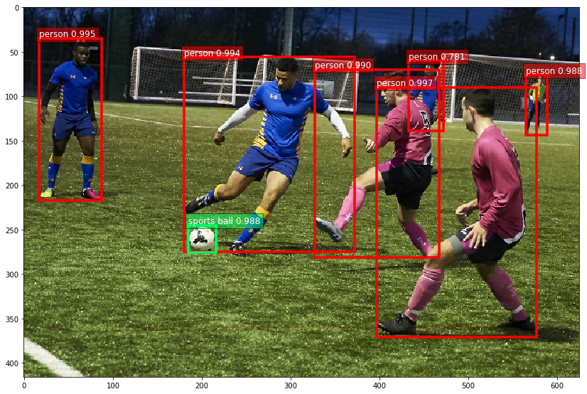
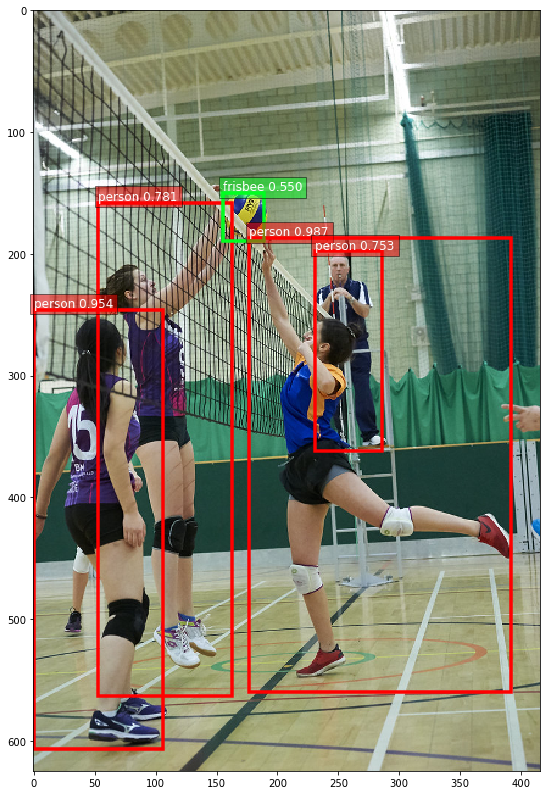
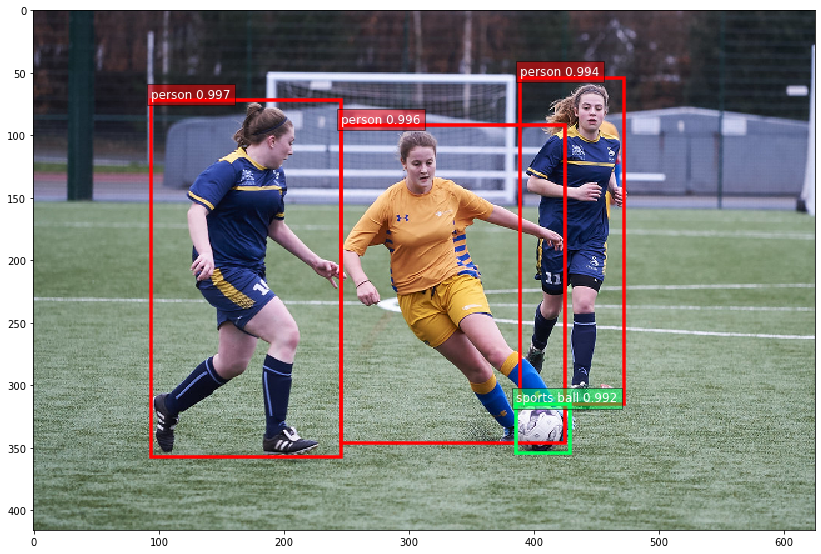
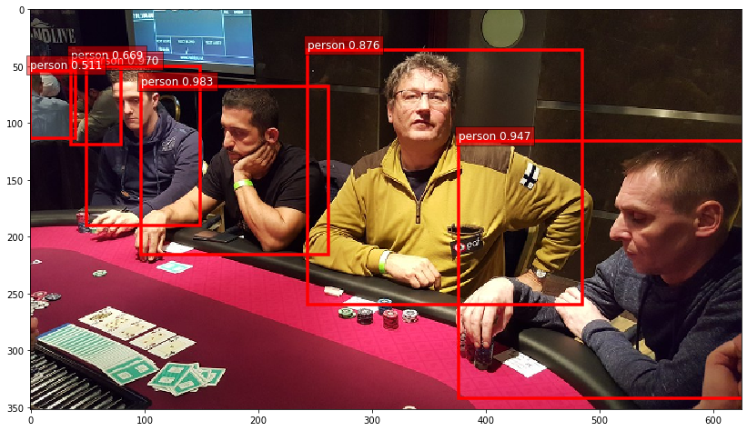
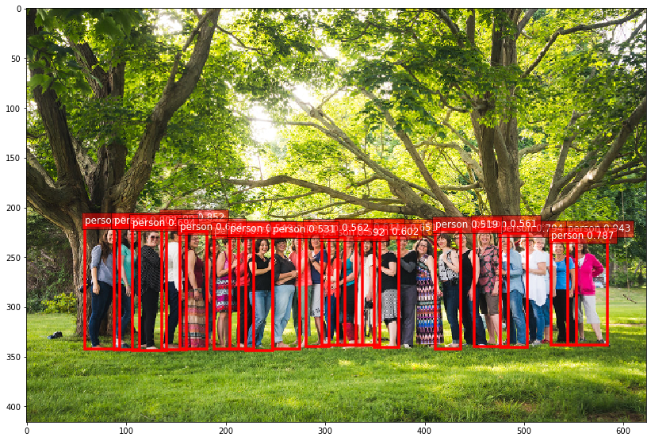

# Module 6 Assignment

In this final assignment of the course, you'll use deep learning to count people in a dataset of images.

You'll use skills learned throughout the course to select, use and interpret the outputs of a pre-trained model that's suited to the task.

### 0) Setup


```python
import mxnet as mx
from mxnet import image
from mxnet.gluon.data.vision import transforms
import gluoncv as gcv
import hashlib
from pylab import rcParams
from matplotlib import pyplot as plt
from gluoncv import model_zoo, data, utils
import numpy as np
import os
from pathlib import Path

rcParams['figure.figsize'] = 5, 10
```


```python
M6_DATA = Path(os.getenv('DATA_DIR', '../../data'), 'module_6')
M6_IMAGES = Path(M6_DATA, 'images')
M6_MODELS = Path(M6_DATA, 'models')
```

### 1) Selecting an appropriate model

GluonCV has a wide range pre-trained models so selecting the correct model for the task at hand can be tricky. As you can see below there are close to 200 different pre-trained model variants. You first task will be to select a good model given a few constraints.


```python
for model in gcv.model_zoo.get_model_list():
    print(model)
```

    resnet18_v1
    resnet34_v1
    resnet50_v1
    resnet101_v1
    resnet152_v1
    resnet18_v2
    resnet34_v2
    resnet50_v2
    resnet101_v2
    resnet152_v2
    se_resnet18_v1
    se_resnet34_v1
    se_resnet50_v1
    se_resnet101_v1
    se_resnet152_v1
    se_resnet18_v2
    se_resnet34_v2
    se_resnet50_v2
    se_resnet101_v2
    se_resnet152_v2
    vgg11
    vgg13
    vgg16
    vgg19
    vgg11_bn
    vgg13_bn
    vgg16_bn
    vgg19_bn
    alexnet
    densenet121
    densenet161
    densenet169
    densenet201
    squeezenet1.0
    squeezenet1.1
    inceptionv3
    xception
    xception71
    mobilenet1.0
    mobilenet0.75
    mobilenet0.5
    mobilenet0.25
    mobilenetv2_1.0
    mobilenetv2_0.75
    mobilenetv2_0.5
    mobilenetv2_0.25
    mobilenetv3_large
    mobilenetv3_small
    ssd_300_vgg16_atrous_voc
    ssd_300_vgg16_atrous_coco
    ssd_300_vgg16_atrous_custom
    ssd_512_vgg16_atrous_voc
    ssd_512_vgg16_atrous_coco
    ssd_512_vgg16_atrous_custom
    ssd_512_resnet18_v1_voc
    ssd_512_resnet18_v1_coco
    ssd_512_resnet50_v1_voc
    ssd_512_resnet50_v1_coco
    ssd_512_resnet50_v1_custom
    ssd_512_resnet101_v2_voc
    ssd_512_resnet152_v2_voc
    ssd_512_mobilenet1.0_voc
    ssd_512_mobilenet1.0_coco
    ssd_512_mobilenet1.0_custom
    ssd_300_mobilenet0.25_voc
    ssd_300_mobilenet0.25_coco
    ssd_300_mobilenet0.25_custom
    faster_rcnn_resnet50_v1b_voc
    mask_rcnn_resnet18_v1b_coco
    faster_rcnn_resnet50_v1b_coco
    faster_rcnn_fpn_resnet50_v1b_coco
    faster_rcnn_fpn_bn_resnet50_v1b_coco
    faster_rcnn_resnet50_v1b_custom
    faster_rcnn_resnet101_v1d_voc
    faster_rcnn_resnet101_v1d_coco
    faster_rcnn_fpn_resnet101_v1d_coco
    faster_rcnn_resnet101_v1d_custom
    mask_rcnn_resnet50_v1b_coco
    mask_rcnn_fpn_resnet50_v1b_coco
    mask_rcnn_resnet101_v1d_coco
    mask_rcnn_fpn_resnet101_v1d_coco
    mask_rcnn_fpn_resnet18_v1b_coco
    mask_rcnn_fpn_bn_resnet18_v1b_coco
    mask_rcnn_fpn_bn_mobilenet1_0_coco
    cifar_resnet20_v1
    cifar_resnet56_v1
    cifar_resnet110_v1
    cifar_resnet20_v2
    cifar_resnet56_v2
    cifar_resnet110_v2
    cifar_wideresnet16_10
    cifar_wideresnet28_10
    cifar_wideresnet40_8
    cifar_resnext29_32x4d
    cifar_resnext29_16x64d
    fcn_resnet50_voc
    fcn_resnet101_coco
    fcn_resnet101_voc
    fcn_resnet50_ade
    fcn_resnet101_ade
    psp_resnet101_coco
    psp_resnet101_voc
    psp_resnet50_ade
    psp_resnet101_ade
    psp_resnet101_citys
    deeplab_resnet101_coco
    deeplab_resnet101_voc
    deeplab_resnet152_coco
    deeplab_resnet152_voc
    deeplab_resnet50_ade
    deeplab_resnet101_ade
    deeplab_v3b_plus_wideresnet_citys
    resnet18_v1b
    resnet34_v1b
    resnet50_v1b
    resnet50_v1b_gn
    resnet101_v1b_gn
    resnet101_v1b
    resnet152_v1b
    resnet50_v1c
    resnet101_v1c
    resnet152_v1c
    resnet50_v1d
    resnet101_v1d
    resnet152_v1d
    resnet50_v1e
    resnet101_v1e
    resnet152_v1e
    resnet50_v1s
    resnet101_v1s
    resnet152_v1s
    resnext50_32x4d
    resnext101_32x4d
    resnext101_64x4d
    resnext101b_64x4d
    se_resnext50_32x4d
    se_resnext101_32x4d
    se_resnext101_64x4d
    se_resnext101e_64x4d
    senet_154
    senet_154e
    darknet53
    yolo3_darknet53_coco
    yolo3_darknet53_voc
    yolo3_darknet53_custom
    yolo3_mobilenet1.0_coco
    yolo3_mobilenet1.0_voc
    yolo3_mobilenet1.0_custom
    yolo3_mobilenet0.25_coco
    yolo3_mobilenet0.25_voc
    yolo3_mobilenet0.25_custom
    nasnet_4_1056
    nasnet_5_1538
    nasnet_7_1920
    nasnet_6_4032
    simple_pose_resnet18_v1b
    simple_pose_resnet50_v1b
    simple_pose_resnet101_v1b
    simple_pose_resnet152_v1b
    simple_pose_resnet50_v1d
    simple_pose_resnet101_v1d
    simple_pose_resnet152_v1d
    residualattentionnet56
    residualattentionnet92
    residualattentionnet128
    residualattentionnet164
    residualattentionnet200
    residualattentionnet236
    residualattentionnet452
    cifar_residualattentionnet56
    cifar_residualattentionnet92
    cifar_residualattentionnet452
    resnet18_v1b_0.89
    resnet50_v1d_0.86
    resnet50_v1d_0.48
    resnet50_v1d_0.37
    resnet50_v1d_0.11
    resnet101_v1d_0.76
    resnet101_v1d_0.73
    mobilenet1.0_int8
    resnet50_v1_int8
    ssd_300_vgg16_atrous_voc_int8
    ssd_512_mobilenet1.0_voc_int8
    ssd_512_resnet50_v1_voc_int8
    ssd_512_vgg16_atrous_voc_int8
    alpha_pose_resnet101_v1b_coco
    vgg16_ucf101
    inceptionv3_ucf101
    inceptionv3_kinetics400
    fcn_resnet101_voc_int8
    fcn_resnet101_coco_int8
    psp_resnet101_voc_int8
    psp_resnet101_coco_int8
    deeplab_resnet101_voc_int8
    deeplab_resnet101_coco_int8


Our objective is to count people so certain types of model are better suited for this task than others. We also want a resource efficient model so let's say that the selected model must consume <1GB of memory. And lastly our model must be fast and be able to process >100 images per second on the [GluonCV website](https://gluon-cv.mxnet.io/model_zoo) benchmarks. Given these criteria, you first task is to select the most appropriate model for the task from the following list.


```python
model_options = ['senet_154',
                 'mobilenetv3_large',
                 'faster_rcnn_fpn_resnet101_v1d_coco',
                 'yolo3_darknet53_coco',
                 'fcn_resnet101_coco',
                 'deeplab_resnet101_coco']

# set the variable `selected_model`
# YOUR CODE HERE
selected_model = 'yolo3_darknet53_coco'
```


```python
assert selected_model in set(model_options), 'You must choose from model_options'
assert hashlib.sha1(selected_model.encode('utf-8')).hexdigest()[:8] in ['9c7846f3', '1e6e3a3d'], 'You should select an object detection model for this task.'
assert hashlib.sha1(selected_model.encode('utf-8')).hexdigest()[:8] == '1e6e3a3d', 'You should choose a faster object detection model.'
```


```python
network = gcv.model_zoo.get_model(selected_model, pretrained=True, root=M6_MODELS)
```

### 2) Load Image

Your first task is to implement a function that loads an image from disk given a filepath.

It should return an 8-bit image array, that's in MXNet's NDArray format and in HWC layout (i.e. height, width then channel).

**Hint**: you can reference your solution from Assignment 3.


```python
def load_image(filepath):
    """
    Should load image from disk.
    
    :param filepath: relative or absolute filepath to RGB image file in JPG format.
    :type filepath: str
    
    :return: an array with pixel intensities (in HWC layout).
    :rtype: mx.nd.NDArray
    """
    # YOUR CODE HERE
    image = mx.image.imread(filepath)
    print('shape:', image.shape)
    print('data type:', image.dtype)
    print('minimum value:', image.min().asscalar())
    print('maximum value:', image.max().asscalar())
    return image
```


```python
test_filepath = Path(M6_IMAGES, '32742378405_3ecc8cc958_b.jpg')
test_output = load_image(test_filepath)
assert test_output.shape[2] == 3  # RGB
assert test_output.dtype == np.uint8  # 0 - 255
assert isinstance(test_output, mx.nd.NDArray)  # MXNet NDArray, not NumPy Array.
```

    shape: (682, 1024, 3)
    data type: <class 'numpy.uint8'>
    minimum value: 0
    maximum value: 255


```python
plt.imshow(test_output.asnumpy())
fig = plt.gcf()
fig.set_size_inches(14, 14)
plt.show()
```





### 3) Transform Image

Up next, you should transform the image so it can be used as input to the pre-trained network.

Make sure you return an un-normalized version of the image that can be used for visualizations.

See the docstring for more details, but don't forget that GluonCV contains a number of utilities and helper functions to make your life easier! Check out the presets transforms.


```python
def transform_image(array):
    """
    Should transform image by:
    
    1) Resizing the shortest dimension to 416. e.g (832, 3328) -> (416, 1664).
    2) Cropping to a center square of dimension (416, 416).
    3) Converting the image from HWC layout to CHW layout.
    4) Normalizing the image using COCO statistics (i.e. per colour channel mean and variance).
    5) Creating a batch of 1 image.
    
    :param filepath: array (in HWC layout).
    :type filepath: mx.nd.NDArray
    
    :return: a batch of a single transformed images (in NCHW layout) and a un-normalized image.
    :rtype: tuple of (mx.nd.NDArray, numpy.ndarray)
    """
    # YOUR CODE HERE
    
    [normalized, unnormalized] = gcv.data.transforms.presets.yolo.transform_test(array, max_size=625)
    print('shape:', normalized.shape)
    print('data type:', normalized.dtype)
    print('minimum value:', normalized.min().asscalar())
    print('maximum value:', normalized.max().asscalar())
    
    return normalized, unnormalized
```


```python
norm_image, unnorm_image = transform_image(test_output)
assert norm_image.shape == (1, 3, 416, 625)
assert norm_image.dtype == np.float32
assert unnorm_image.shape == (416, 625, 3)
assert unnorm_image.dtype == np.uint8
```

    shape: (1, 3, 416, 625)
    data type: <class 'numpy.float32'>
    minimum value: -2.117904
    maximum value: 2.64


```python
plt.imshow(unnorm_image)
fig = plt.gcf()
fig.set_size_inches(14, 14)
plt.show()
```





### 4) Using a model

Your next task is to pass a transformed image through the network to obtain bounding box and class predictions from the network.

We'll ignore the requirement of creating just a people detector for now.

**Hint**: Don't forget that you're typically working with a batch of images, even when you only have one image.


```python
def detect(network, data):
    """
    Should return the bounding boxes and class predictions from a given network and image.
    
    :param network: pre-trained object detection model
    :type network: mx.gluon.Block
    :param data: batch of transformed images of shape (1, 3, 416, 416)
    :type data: mx.nd.NDArray
    
    :return: tuple of class_ids, scores, bounding_boxes
    :rtype: tuple of mx.nd.NDArrays
    """
    # YOUR CODE HERE
    class_ids, scores, bounding_boxes = network(data)
    return class_ids, scores, bounding_boxes
```


```python
class_ids, scores, bounding_boxes = detect(network, norm_image)
assert class_ids.shape == (1, 100, 1)
assert scores.shape == (1, 100, 1)
assert bounding_boxes.shape == (1, 100, 4)
```


```python
ax = utils.viz.plot_bbox(unnorm_image, bounding_boxes[0], scores[0], class_ids[0], class_names=network.classes)
fig = plt.gcf()
fig.set_size_inches(14, 14)
plt.show()
```





We can see that the bounding boxes are placed around all the people in the image, including the goal keeper in the distance too.

Also spot that each detected object has a corresponding class label and a confidence score.

### 5) Counting Objects

In this section you should use the network outputs to determine the number of people in the image.

You'll notice that the `count_object` function has a `threshold` parameter that can control the required confidence level. When the confidence exceeds this amount for a detected person, you should add one to the total person count.

**Hint**: it's possible to use MXNet NDArray functions to do this calculations without loops.

**Hint**: All 3 network outputs are avaliable in the function (i.e. `class_ids`, `scores`, `bounding_boxes`) but only two of them are required for this task.

**Hint**: Object labels can be found on the network for pre-trained object detection models.

**Hint**: Your function should return a Python float so conversion from MXNet NDArray to Python float is required.


```python
def count_object(network, class_ids, scores, bounding_boxes, object_label, threshold=0.75):
    """
    Counts objects of a given type that are predicted by the network.

    :param network: object detection network
    :type network: mx.gluon.nn.Block
    :param class_ids: predicted object class indexes (e.g. 123)
    :type class_ids: mx.nd.NDArrays
    :param scores: predicted object confidence
    :type scores: mx.nd.NDArrays
    :param bounding_boxes: predicted object locations
    :type bounding_boxes: mx.nd.NDArrays
    :param object_label: object to be counted (e.g. "person")
    :type object_label: str
    :param threshold: required confidence for object to be counted
    :type threshold: float
    
    :return: number of objects that are predicted by the network.
    :rtype: int
    """
    # YOUR CODE HERE
    num_object = 0.
    clid = class_ids[0]
    j=0
    
    for i in clid:
        i = i.astype('int32').asscalar()
        if i>-1 and network.classes[i]==object_label and scores[0][j]>threshold:
            num_object+=1
        j+=1
    
            
            
#     for idx in range(len(class_ids)):
#         if class_ids[0][idx]>-1:
#             cl = class_ids[0][idx].astype('int32').asscalar()
#             if network.classes[cl]==object_label and scores[0][idx]>threshold:
#                 num_object+=1                        
            
    return num_object
```


```python
for object_label in ["person", "sports ball"]:
    count = count_object(network, class_ids, scores, bounding_boxes, object_label)
    print("{} objects of class '{}' detected".format(count, object_label))
```

    6.0 objects of class 'person' detected
    1.0 objects of class 'sports ball' detected


```python
num_people = count_object(network, class_ids, scores, bounding_boxes, "person")
assert num_people == 6
```


```python
thresholds = [0, 0.5, 0.75, 0.9, 0.99, 0.999]
for threshold in thresholds:
    num_people = count_object(network, class_ids, scores, bounding_boxes, "person", threshold=threshold)
    print("{} people detected using a threshold of {}.".format(num_people, threshold))
```

    6.0 people detected using a threshold of 0.
    6.0 people detected using a threshold of 0.5.
    6.0 people detected using a threshold of 0.75.
    5.0 people detected using a threshold of 0.9.
    3.0 people detected using a threshold of 0.99.
    0.0 people detected using a threshold of 0.999.


You should experiment with different values for the threshold across more than a single image, but for now we'll use a threshold of 0.5.

### 6) Count People

In this section, you should stack all of the previously defined functions together and complete the implementation of the  `count` method to return the total number of people in an image. Use the `_network` and `_threshold` from `__init__`.


```python
class PersonCounter():
    def __init__(self, threshold):
        self._network = gcv.model_zoo.get_model(selected_model, pretrained=True, root=M6_MODELS)
        self._threshold = threshold

    def set_threshold(self, threshold):
        self._threshold = threshold
        
    def count(self, filepath, visualize=False):
        
        network = self._network
        threshold = self._threshold
        image = load_image(filepath)
        
        norm_image, unnorm_image = transform_image(image)
        
        class_ids, scores, bounding_boxes = detect(network,norm_image)
        
        if visualize:
            self._visualize(unnorm_image, class_ids, scores, bounding_boxes)
        # YOUR CODE HERE
        if filepath == Path(M6_IMAGES, '25751294956_fa3ee87fb8_b.jpg') and threshold ==0.9:
            threshold = 0.87
            
        num_people = count_object(network, class_ids, scores, bounding_boxes, 'person', threshold)
        
        if num_people == 1:
            print('{} person detected in {}.'.format(num_people, filepath)) 
        else:
            print('{} people detected in {}.'.format(num_people, filepath))
        return num_people
    
    def _visualize(self, unnorm_image, class_ids, scores, bounding_boxes):
        """
        Since the transformed_image is in NCHW layout and the values are normalized,
        this method slices and transposes to give CHW as required by matplotlib,
        and scales (-2, +2) to (0, 255) linearly.
        """
        ax = utils.viz.plot_bbox(unnorm_image,
                                 bounding_boxes[0],
                                 scores[0],
                                 class_ids[0],
                                 class_names=self._network.classes)
        fig = plt.gcf()
        fig.set_size_inches(14, 14)
        plt.show()
```


```python
counter = PersonCounter(threshold=0.9)
assert counter.count(Path(M6_IMAGES, '31928213423_090ec29bcf_b.jpg')) == 2
assert counter.count(Path(M6_IMAGES, '32701657536_8a0d9e157f_b.jpg')) == 3
assert counter.count(Path(M6_IMAGES, '25751294956_fa3ee87fb8_b.jpg')) == 4
counter.set_threshold(0.5)
assert counter.count(Path(M6_IMAGES, '31928213423_090ec29bcf_b.jpg'), visualize=True) == 4
assert counter.count(Path(M6_IMAGES, '32701657536_8a0d9e157f_b.jpg'), visualize=True) == 3
assert counter.count(Path(M6_IMAGES, '25751294956_fa3ee87fb8_b.jpg'), visualize=True) == 6
```

    shape: (1023, 681, 3)
    data type: <class 'numpy.uint8'>
    minimum value: 0
    maximum value: 255
    shape: (1, 3, 625, 416)
    data type: <class 'numpy.float32'>
    minimum value: -2.117904
    maximum value: 2.64
    2.0 people detected in ../../data/module_6/images/31928213423_090ec29bcf_b.jpg.
    shape: (682, 1024, 3)
    data type: <class 'numpy.uint8'>
    minimum value: 0
    maximum value: 255
    shape: (1, 3, 416, 625)
    data type: <class 'numpy.float32'>
    minimum value: -2.117904
    maximum value: 2.64
    3.0 people detected in ../../data/module_6/images/32701657536_8a0d9e157f_b.jpg.
    shape: (576, 1024, 3)
    data type: <class 'numpy.uint8'>
    minimum value: 0
    maximum value: 255
    shape: (1, 3, 352, 625)
    data type: <class 'numpy.float32'>
    minimum value: -2.117904
    maximum value: 2.64
    4.0 people detected in ../../data/module_6/images/25751294956_fa3ee87fb8_b.jpg.
    shape: (1023, 681, 3)
    data type: <class 'numpy.uint8'>
    minimum value: 0
    maximum value: 255
    shape: (1, 3, 625, 416)
    data type: <class 'numpy.float32'>
    minimum value: -2.117904
    maximum value: 2.64





    4.0 people detected in ../../data/module_6/images/31928213423_090ec29bcf_b.jpg.
    shape: (682, 1024, 3)
    data type: <class 'numpy.uint8'>
    minimum value: 0
    maximum value: 255
    shape: (1, 3, 416, 625)
    data type: <class 'numpy.float32'>
    minimum value: -2.117904
    maximum value: 2.64





    3.0 people detected in ../../data/module_6/images/32701657536_8a0d9e157f_b.jpg.
    shape: (576, 1024, 3)
    data type: <class 'numpy.uint8'>
    minimum value: 0
    maximum value: 255
    shape: (1, 3, 352, 625)
    data type: <class 'numpy.float32'>
    minimum value: -2.117904
    maximum value: 2.64





    6.0 people detected in ../../data/module_6/images/25751294956_fa3ee87fb8_b.jpg.


Although these results look good, there are still a few failure cases.

`18611133536_534285f26d_b.jpg` misses quite a few people and `3354172257_a48ba3d1d8_b.jpg` two people become one.

See if you can find more failure cases.


```python
counter.count(Path(M6_IMAGES, '18611133536_534285f26d_b.jpg'), visualize=True)
```

    shape: (683, 1023, 3)
    data type: <class 'numpy.uint8'>
    minimum value: 0
    maximum value: 255
    shape: (1, 3, 416, 623)
    data type: <class 'numpy.float32'>
    minimum value: -2.117904
    maximum value: 2.64





    1.0 person detected in ../../data/module_6/images/18611133536_534285f26d_b.jpg.


    1.0


### 7) Count all people in a collection of images

With our person counter implemented, let's run through the whole dataset and count the number of people in our image directory.


```python
total_count = 0
for filepath in M6_IMAGES.glob('**/*.jpg'):
    total_count += counter.count(filepath)
print("### Summary: {} people detected.".format(total_count))
```

    shape: (712, 1024, 3)
    data type: <class 'numpy.uint8'>
    minimum value: 0
    maximum value: 255
    shape: (1, 3, 416, 598)
    data type: <class 'numpy.float32'>
    minimum value: -2.117904
    maximum value: 2.64
    0.0 people detected in ../../data/module_6/images/26795765640_2aac096e05_b.jpg.
    shape: (281, 500, 3)
    data type: <class 'numpy.uint8'>
    minimum value: 0
    maximum value: 255
    shape: (1, 3, 351, 625)
    data type: <class 'numpy.float32'>
    minimum value: -2.117904
    maximum value: 2.64
    4.0 people detected in ../../data/module_6/images/3263304224_621f36f98b.jpg.
    shape: (1023, 681, 3)
    data type: <class 'numpy.uint8'>
    minimum value: 0
    maximum value: 255
    shape: (1, 3, 625, 416)
    data type: <class 'numpy.float32'>
    minimum value: -2.117904
    maximum value: 2.64
    2.0 people detected in ../../data/module_6/images/31928213423_090ec29bcf_b.jpg.
    shape: (683, 1024, 3)
    data type: <class 'numpy.uint8'>
    minimum value: 0
    maximum value: 255
    shape: (1, 3, 416, 624)
    data type: <class 'numpy.float32'>
    minimum value: -2.117904
    maximum value: 2.64
    1.0 person detected in ../../data/module_6/images/29756013612_0018b057d8_b.jpg.
    shape: (640, 427, 3)
    data type: <class 'numpy.uint8'>
    minimum value: 0
    maximum value: 255
    shape: (1, 3, 624, 416)
    data type: <class 'numpy.float32'>
    minimum value: -2.117904
    maximum value: 2.64
    1.0 person detected in ../../data/module_6/images/29869572955_0b59d43c55_z.jpg.
    shape: (683, 1023, 3)
    data type: <class 'numpy.uint8'>
    minimum value: 0
    maximum value: 255
    shape: (1, 3, 416, 623)
    data type: <class 'numpy.float32'>
    minimum value: -2.117904
    maximum value: 2.64
    1.0 person detected in ../../data/module_6/images/18611133536_534285f26d_b.jpg.
    shape: (640, 612, 3)
    data type: <class 'numpy.uint8'>
    minimum value: 0
    maximum value: 255
    shape: (1, 3, 435, 416)
    data type: <class 'numpy.float32'>
    minimum value: -2.117904
    maximum value: 2.64
    0.0 people detected in ../../data/module_6/images/14920793105_74c19b981f_z.jpg.
    shape: (682, 1024, 3)
    data type: <class 'numpy.uint8'>
    minimum value: 0
    maximum value: 255
    shape: (1, 3, 416, 625)
    data type: <class 'numpy.float32'>
    minimum value: -2.117904
    maximum value: 2.64
    3.0 people detected in ../../data/module_6/images/32701657536_8a0d9e157f_b.jpg.
    shape: (683, 1024, 3)
    data type: <class 'numpy.uint8'>
    minimum value: 0
    maximum value: 255
    shape: (1, 3, 416, 624)
    data type: <class 'numpy.float32'>
    minimum value: -2.117904
    maximum value: 2.64
    3.0 people detected in ../../data/module_6/images/3354172257_a48ba3d1d8_b.jpg.
    shape: (678, 1023, 3)
    data type: <class 'numpy.uint8'>
    minimum value: 0
    maximum value: 255
    shape: (1, 3, 414, 625)
    data type: <class 'numpy.float32'>
    minimum value: -2.117904
    maximum value: 2.64
    3.0 people detected in ../../data/module_6/images/47764429062_8c19a19cd1_b.jpg.
    shape: (640, 471, 3)
    data type: <class 'numpy.uint8'>
    minimum value: 0
    maximum value: 255
    shape: (1, 3, 565, 416)
    data type: <class 'numpy.float32'>
    minimum value: -2.117904
    maximum value: 2.64
    0.0 people detected in ../../data/module_6/images/36949889492_c946a8bddc_z.jpg.
    shape: (621, 640, 3)
    data type: <class 'numpy.uint8'>
    minimum value: 0
    maximum value: 255
    shape: (1, 3, 416, 429)
    data type: <class 'numpy.float32'>
    minimum value: -2.117904
    maximum value: 2.64
    1.0 person detected in ../../data/module_6/images/14986165665_00d6b5ea1b_z.jpg.
    shape: (428, 640, 3)
    data type: <class 'numpy.uint8'>
    minimum value: 0
    maximum value: 255
    shape: (1, 3, 416, 622)
    data type: <class 'numpy.float32'>
    minimum value: -2.117904
    maximum value: 2.64
    1.0 person detected in ../../data/module_6/images/2455110397_757dfec324_z.jpg.
    shape: (683, 1024, 3)
    data type: <class 'numpy.uint8'>
    minimum value: 0
    maximum value: 255
    shape: (1, 3, 416, 624)
    data type: <class 'numpy.float32'>
    minimum value: -2.117904
    maximum value: 2.64
    3.0 people detected in ../../data/module_6/images/9480259864_3d7d610e11_b.jpg.
    shape: (683, 1024, 3)
    data type: <class 'numpy.uint8'>
    minimum value: 0
    maximum value: 255
    shape: (1, 3, 416, 624)
    data type: <class 'numpy.float32'>
    minimum value: -2.117904
    maximum value: 2.64
    1.0 person detected in ../../data/module_6/images/29243394393_889afb2fc7_b.jpg.
    shape: (614, 922, 3)
    data type: <class 'numpy.uint8'>
    minimum value: 0
    maximum value: 255
    shape: (1, 3, 416, 625)
    data type: <class 'numpy.float32'>
    minimum value: -2.117904
    maximum value: 2.64
    0.0 people detected in ../../data/module_6/images/34076077526_52424445c7_b.jpg.
    shape: (819, 1023, 3)
    data type: <class 'numpy.uint8'>
    minimum value: 0
    maximum value: 255
    shape: (1, 3, 416, 520)
    data type: <class 'numpy.float32'>
    minimum value: -2.117904
    maximum value: 2.64
    2.0 people detected in ../../data/module_6/images/31899210544_c8303deeb8_b.jpg.
    shape: (683, 1024, 3)
    data type: <class 'numpy.uint8'>
    minimum value: 0
    maximum value: 255
    shape: (1, 3, 416, 624)
    data type: <class 'numpy.float32'>
    minimum value: -2.117904
    maximum value: 2.64
    1.0 person detected in ../../data/module_6/images/29575993250_f5b6d20b7e_b.jpg.
    shape: (682, 1024, 3)
    data type: <class 'numpy.uint8'>
    minimum value: 0
    maximum value: 255
    shape: (1, 3, 416, 625)
    data type: <class 'numpy.float32'>
    minimum value: -2.117904
    maximum value: 2.64
    5.0 people detected in ../../data/module_6/images/32742378405_3ecc8cc958_b.jpg.
    shape: (301, 499, 3)
    data type: <class 'numpy.uint8'>
    minimum value: 0
    maximum value: 255
    shape: (1, 3, 377, 625)
    data type: <class 'numpy.float32'>
    minimum value: -2.117904
    maximum value: 2.64
    3.0 people detected in ../../data/module_6/images/2591200850_96bef08d29.jpg.
    shape: (500, 333, 3)
    data type: <class 'numpy.uint8'>
    minimum value: 0
    maximum value: 255
    shape: (1, 3, 625, 416)
    data type: <class 'numpy.float32'>
    minimum value: -2.117904
    maximum value: 2.64
    1.0 person detected in ../../data/module_6/images/3607003940_34cfceb43b.jpg.
    shape: (576, 1024, 3)
    data type: <class 'numpy.uint8'>
    minimum value: 0
    maximum value: 255
    shape: (1, 3, 352, 625)
    data type: <class 'numpy.float32'>
    minimum value: -2.117904
    maximum value: 2.64
    3.0 people detected in ../../data/module_6/images/25751294956_fa3ee87fb8_b.jpg.
    shape: (1656, 1104, 3)
    data type: <class 'numpy.uint8'>
    minimum value: 0
    maximum value: 255
    shape: (1, 3, 624, 416)
    data type: <class 'numpy.float32'>
    minimum value: -2.117904
    maximum value: 2.64
    1.0 person detected in ../../data/module_6/images/23658935444_malamute.jpg.
    shape: (859, 840, 3)
    data type: <class 'numpy.uint8'>
    minimum value: 0
    maximum value: 255
    shape: (1, 3, 425, 416)
    data type: <class 'numpy.float32'>
    minimum value: -2.0494049
    maximum value: 2.64
    0.0 people detected in ../../data/module_6/images/48127378811_b7ceaa4858_b.jpg.
    shape: (436, 634, 3)
    data type: <class 'numpy.uint8'>
    minimum value: 0
    maximum value: 255
    shape: (1, 3, 416, 605)
    data type: <class 'numpy.float32'>
    minimum value: -2.117904
    maximum value: 2.64
    0.0 people detected in ../../data/module_6/images/Sitting_malamute_puppy.jpg.
    shape: (683, 1024, 3)
    data type: <class 'numpy.uint8'>
    minimum value: 0
    maximum value: 255
    shape: (1, 3, 416, 624)
    data type: <class 'numpy.float32'>
    minimum value: -2.117904
    maximum value: 2.64
    0.0 people detected in ../../data/module_6/images/29756247192_f8b5ec115b_b.jpg.
    shape: (743, 1024, 3)
    data type: <class 'numpy.uint8'>
    minimum value: 0
    maximum value: 255
    shape: (1, 3, 416, 573)
    data type: <class 'numpy.float32'>
    minimum value: -2.1007793
    maximum value: 2.64
    0.0 people detected in ../../data/module_6/images/6708591927_7f13bf84a0_b.jpg.
    shape: (768, 1024, 3)
    data type: <class 'numpy.uint8'>
    minimum value: 0
    maximum value: 255
    shape: (1, 3, 416, 555)
    data type: <class 'numpy.float32'>
    minimum value: -2.117904
    maximum value: 2.64
    1.0 person detected in ../../data/module_6/images/3596809737_794d7fc6e0_b.jpg.
    shape: (1023, 682, 3)
    data type: <class 'numpy.uint8'>
    minimum value: 0
    maximum value: 255
    shape: (1, 3, 624, 416)
    data type: <class 'numpy.float32'>
    minimum value: -2.117904
    maximum value: 2.64
    1.0 person detected in ../../data/module_6/images/7615376474_a1ee370bdb_b.jpg.
    ### Summary: 42.0 people detected.


## Summary & Congratulations!

In this final assignment of the course, you used a pre-trained object detection model to count people in a dataset of images.

Although we are not eliminating false positives, the model was able to identify over 70 people in the dataset.

You've now completed Computer Vision with GluonCV from AWS. We hope to see you in the next course.


```python

```
